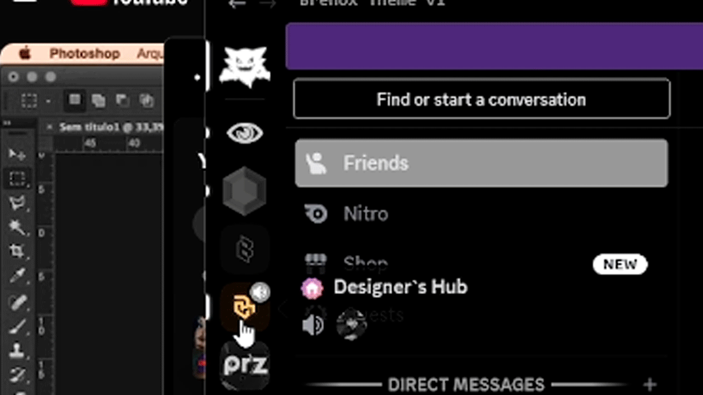

# Brenox Theme

<p align="center">
  
</p>

A minimal and performance-focused Discord theme built on top of ClearVision V7.

---

## Features

- Black & white server icons (color on hover)
- Grayscale friends and activity panels
- Clean minimal interface
- Optional glass-ready structure
- Custom header branding

---

## Requirements

- Discord Desktop
- Vencord installed

---

## Installation

### 1. Enable Transparency (Optional – For Glass Effect)

Settings → Vencord → Enable Transparency

If transparency does not activate, launch Discord with:

```
--enable-transparent-visuals
```

---

### 2. Install the Theme

1. Download `Brenox-Theme.theme.css`
2. Open Discord → Settings → Themes
3. Click **Open Themes Folder**
4. Place the file inside
5. Enable the theme

---

## Screenshots

Place your GIF previews inside:

```
/screenshots
```

Example files:

- preview.gif
- glass-effect.gif
- grayscale-demo.gif

They will automatically render in the README when referenced.

---

## Versioning

Current Version: 1.0.0

See `CHANGELOG.md` for details.

---

## License

MIT License
